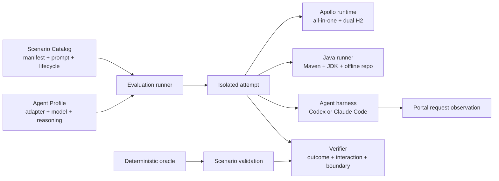

# Apollo Evals

**English** | [简体中文](README.zh-CN.md)

Apollo Evals aims to build an evaluation framework and task suite for real-world Apollo usage scenarios, measuring how well different combinations of agent harnesses and models complete real-world Apollo tasks.

## Scenario catalog

| Product track | Scenario | Deterministic outcome |
|---|---|---|
| Apollo CLI | `cli-config-publish` | Correctly typed item, active release, Config Service value, CLI trace, and distractor boundary |
| Apollo CLI | `cli-release-rollback` | Restored release and config, deactivated bad release, list/rollback trace, and distractor boundary |
| Apollo CLI | `cli-namespace-create-publish` | Private non-default namespace, JSON-typed item, release, Config Service value, and CLI trace |
| Apollo CLI | `cli-config-sync-release` | Target create/update/delete convergence, target release, unchanged source and distractor, and diff/apply/delete/release trace |
| Apollo CLI | `cli-auth-capability-scope` | Token capability discovery, scoped item and release, Config Service value, CLI trace, and distractor boundary |
| Apollo CLI | `cli-public-namespace-share` | Exact public namespace, provider release, cross-app Config Service value, CLI trace, and consumer boundary |
| Apollo Java Client | `java-client-typed-read` | Offline compilation and real typed reads with explicit appId/namespace and a default value |
| Apollo Java Client | `java-client-change-listener` | Ready handshake, hidden publish, exact old/new/changeType callback, and bounded clean exit |
| Apollo Java Client | `java-client-cluster-precedence` | Offline compilation, cluster override read, missing-cluster fallback, and distractor boundary |
| Apollo Java Client | `java-client-mixed-namespace-formats` | Offline compilation, typed YAML reads, exact JSON file content, and distractor boundary |

## Design model

The repository separates tasks, run configuration, and verification logic into three domain objects:

- **Scenario Catalog**: `scenarios/<product-track>/<scenario>/` groups tasks by the Apollo CLI and Java Client product tracks. A scenario contains `scenario.json` for harness metadata, `PROMPT.md` for the agent-visible task, `scenario.ts` for the `setup / verify / runOracle` lifecycle, and an optional `workspace/`.
- **Agent Profiles**: `agent-profiles/<adapter>/` describes an agent harness, model, and reasoning-effort combination without embedding task or runtime logic.
- **Evaluation + Validation**: an evaluation selects a scenario suite and an agent profile to produce scored attempts. Validation proves that every initial baseline fails verification, its deterministic oracle passes, and unrelated-resource boundaries remain intact.



Agent prompts and harness manifests are separate files, product tracks are first-class catalog levels, and scenario lifecycle, agent profile, evaluation execution, and scenario validation each have their own protocol.

## Isolated runtime

Every attempt creates a dedicated Docker network, an Apollo container from the locked image ID, and two uniquely named in-memory H2 databases. The container still listens on 8070/8080/8090 while Docker assigns dynamic host ports, so the harness does not depend on fixed host ports or a global serial lock. Readiness covers all three HTTP endpoints, Config/Admin registration, and a real Portal management request. Teardown removes the attempt containers and network after success, failure, timeout, or verifier exceptions.

Java scenarios start a separate Maven/JDK runner container on the attempt network and reach Config Service at `http://apollo:8080`. Preparation caches Apollo Java Client and build plugins from Maven Central. Each attempt copies that cache into a temporary `/m2` inside the runner and verifies the final workspace offline without reading or mutating the host's `~/.m2`.

`setup` and `verify` use real Portal management and Config Service requests; they never inspect H2 directly. The harness keeps the Portal administrator session private and gives management scenarios a randomized user token scoped to only the target app and `LOCAL`. Each setup step also creates a similarly named distractor app whose state must remain unchanged.

## Requirements and product versions

- Node.js 22+, pnpm, a Docker daemon, `curl`, and `tar`
- an authenticated host Codex or Claude Code CLI supporting the selected adapter's required non-interactive options, only for evaluation/replay execution; no exact CLI version is pinned
- no local Apollo source checkout, JDK, Maven, Rust, or Cargo

Default product coordinates live in `apollo-evals.config.ts`: Apollo `nobodyiam/apollo-quick-start:3.0.0-SNAPSHOT`, Apollo Java Client `2.5.0` from Maven Central, and Apollo CLI `0.1.0` from GitHub Releases. Maintainers configure versions and remote coordinates; the CLI asset SHA-256 is resolved from the GitHub Release API.

`pnpm prepare` uses a local Apollo image when available, ensures the Java runner image exists, downloads the CLI release archive, and warms a project-local `.cache/m2` inside the Java runner image. The generated `versions.lock.json` records resolved product versions, remote URLs, SHA-256 values, image IDs/RepoDigests, and platform details. Later commands reject artifact damage or local configuration drift after preparation.

## Commands

```bash
pnpm install --ignore-scripts
pnpm prepare
pnpm check
pnpm validate

# One-scenario smoke attempt
pnpm evaluate -- --scenario cli-config-publish \
  --profile codex-gpt-5.6-sol-medium --attempts 1

# One attempt for each of the ten scenarios
pnpm evaluate -- --suite smoke \
  --profile codex-gpt-5.6-sol-medium

# Formal evaluation: three independent attempts per scenario
pnpm evaluate -- --suite benchmark \
  --profile codex-gpt-5.6-sol-medium

pnpm replay -- --run-id <run-id> --scenario <scenario-id> --attempt <n>
pnpm report -- --run-id <run-id>
```

`--seed <integer>` makes randomized app IDs, keys, values, and attempt seeds reproducible. Replay reads the recorded attempt seed and runs a new isolated attempt.

The default is `codex-gpt-5.6-sol-medium`, and each profile ID gets a separate result path. The available profiles are:

| Profile | Adapter | Model | Effort |
|---|---|---|---|
| `codex-gpt-5.6-sol-medium` | Codex | `gpt-5.6-sol` | `medium` |
| `claude-code-deepseek-v4-flash-medium` | Claude Code | `deepseek-v4-flash` | `medium` |

Add new configurations as `AgentProfile` files under `agent-profiles/<adapter>/`.

## Agent adapters

The Codex adapter runs non-interactively with JSONL and ephemeral sessions, ignores user configuration and rules, enables strict configuration, does not require a Git repository, and uses a network-enabled workspace-write sandbox. Agent workspaces live outside this repository under a Docker-mountable user cache root, overridable with `APOLLO_EVALS_WORKSPACE_ROOT`, and contain only the scenario starter. Final Java workspaces are copied into attempt artifacts before the originals are deleted.

The adapter deliberately invokes the host `codex` executable so local contributors can use their existing ChatGPT coding plan and authentication. Before evaluation or replay execution, the harness probes actual `codex exec` capabilities rather than enforcing an exact version.

The Claude Code adapter similarly invokes the host `claude` executable. It runs in print mode with stream JSON, disables session persistence and user/project customizations, passes the profile's model and effort literally, and grants non-interactive tool permissions inside the dedicated attempt workspace. Claude authentication and Anthropic-compatible endpoint variables are inherited from the host; the harness capability-checks the CLI before execution.

- CLI scenarios receive the pinned `apollo` executable on PATH plus `APOLLO_SERVER` and `APOLLO_TOKEN`; they must use the tested CLI resource surface.
- Java scenarios receive a starter, `APOLLO_META` pointing to Config Service, and `mvn`/`java` wrappers into the isolated Java runner, but no management token. The runner is rebuilt after the agent finishes and the hidden verifier compiles and runs the final workspace offline.

This is an open-book local evaluation. Recognizable web-search URLs are recorded as a secondary metric but do not affect pass/fail.

## Verification and results

An attempt passes only when every `outcome`, `interaction`, and `boundary` check passes:

- `outcome`: Apollo's final state and client-visible behavior are correct;
- `interaction`: the tested Apollo product surface was actually used rather than bypassed;
- `boundary`: baseline, distractor, and other out-of-scope resources were not changed.

Agent timeout and adapter failure are task failures. Docker/runtime startup failures and verifier crashes are `infra_error`; a logical attempt may retry infrastructure errors up to two times.

Artifacts are written to:

```text
results/<run>/<profile>/<scenario>/<attempt>/
  result.json
  provenance.json
  transcript.jsonl
  transcript.normalized.json
  apollo-requests.jsonl
  server.log
  agent.stderr
  prompt.rendered.md
  workspace/
```

Each run root contains `summary.json` and `summary.md`. Results record the detected agent CLI version, adapter, configured model identifier, and reasoning effort. The primary metric is the macro-average success rate across profile/scenario pairs; a stable scenario requires every non-infrastructure attempt to pass. Efficiency medians include passed attempts only.

The Portal proxy records timestamps, methods, paths, statuses, User-Agent values, and authentication types, but not request bodies or credential values. Harness-managed traces and logs redact known Apollo and adapter credentials, Authorization headers, and cookies before writing.

## Scenario validation

`pnpm validate` runs three gates for each scenario against a fresh Apollo instance:

1. `verify` immediately after `setup` must fail;
2. `verify` after the hidden deterministic `runOracle` must pass;
3. at least one `boundary` check must exist and all boundary checks must pass.

Use `pnpm validate -- --scenario <scenario-id>` while developing one scenario. Validation checks the scenario/verifier loop; it is not an agent-profile capability score.

## Contributing

We especially welcome contributions that turn real Apollo experience into reproducible test scenarios or add adapters for more agent harnesses. Scenarios define what must be accomplished and how it is judged; adapters define how an agent is run. Keeping them independent lets every scenario be reused fairly across agents, models, and reasoning efforts.

### Contributing real-world scenarios

A scenario is not an isolated prompt but an evaluation unit that can prepare, execute, and verify itself. A strong scenario should come from a real configuration-management or client use case and define an unambiguous outcome, required product-interaction evidence, and boundaries that protect unrelated resources. The agent-visible task should state the user goal and necessary context without leaking a solution; the harness should own random values, credentials, and hidden verification conditions.

To contribute a scenario:

1. Add a directory under `scenarios/cli/<scenario>/` or `scenarios/java-client/<scenario>/`. Discovery is automatic, and the scenario ID must follow `<group>-<scenario>`.
2. Include `scenario.json`, `PROMPT.md`, `scenario.ts`, and a maintainer-facing `README.md`; scenarios that need starter files, such as Java tasks, may also include `workspace/`.
3. In `scenario.ts`, implement reproducible `setup`, `verify` checks covering `outcome / interaction / boundary`, and a `runOracle` that completes the task deterministically. The initial state should include randomized targets and distractors that expose accidental changes, and setup and verification should use real Apollo interfaces instead of reading the database directly.
4. Add the scenario to the appropriate suite and summarize its deterministic result in the catalog above. Run `pnpm check`, then `pnpm validate -- --scenario <scenario-id>` to prove that the initial state cannot pass, the oracle always passes, and boundary checks are complete.

The `README.md` beside each existing scenario documents its goal, initial state, grading criteria, hidden details, and non-goals, and is a useful starting point for new designs. If a scenario needs a new Apollo product surface or runtime capability, consider opening an issue first to describe the real use case and required boundaries before extending the catalog model and runtime.

### Contributing an agent adapter

An agent profile only selects an adapter, model, and reasoning effort. The adapter invokes the agent CLI, isolates its execution environment, and converts its output into the common `AgentRunResult`. New adapters should support non-interactive execution and timeout termination, persist redacted raw transcripts and stderr, and normalize messages, commands, file changes, web searches, and token usage where available so existing verifiers, artifacts, and metrics remain agent-independent.

To contribute an adapter:

1. Implement `AgentAdapter` under `src/agent/`, with a separate parser for streaming or JSONL output when needed, and extend the adapter type supported by `AgentProfile`.
2. Wire adapter selection and its isolated environment into `src/core/runner.ts`, and add host CLI and non-interactive capability checks in `src/core/verify.ts`. Probe the capabilities and options the adapter actually requires instead of pinning one exact CLI version.
3. Add unit tests for output normalization, usage accounting, failure and timeout handling, and capability checks, then provide at least one runnable profile under `agent-profiles/<adapter>/`.
4. Run `pnpm check` and a one-attempt `pnpm evaluate` smoke test on a representative scenario, then update the profile table and adapter behavior above.

## Design reference

Task organization and independent verification were informed by [Supabase Evals](https://github.com/supabase/evals).
