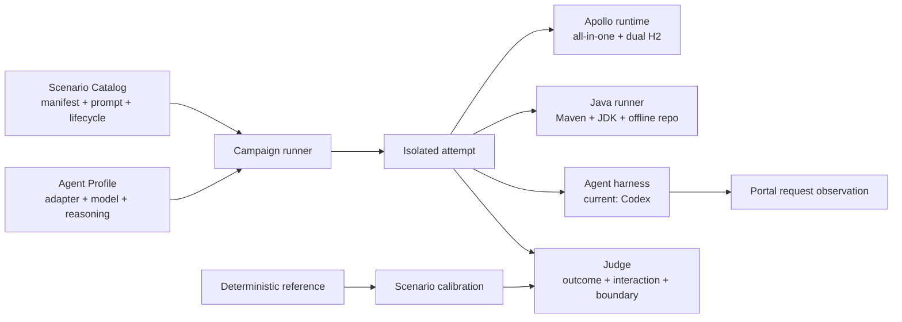

# Apollo Evals

**English** | [简体中文](README.zh-CN.md)

Apollo Evals aims to build an evaluation framework and task suite for real-world Apollo usage scenarios, measuring how well different combinations of agent harnesses and models complete real-world Apollo tasks.

## Scenario catalog

| Product track | Scenario | Deterministic outcome |
|---|---|---|
| Apollo CLI | `cli-config-publish` | Correctly typed item, active release, Config Service value, CLI trace, and distractor boundary |
| Apollo CLI | `cli-release-rollback` | Restored release and config, deactivated bad release, list/rollback trace, and distractor boundary |
| Apollo CLI | `cli-namespace-create-publish` | Private non-default namespace, JSON-typed item, release, Config Service value, and CLI trace |
| Apollo CLI | `cli-config-sync-release` | Target create/update/delete convergence, target release, unchanged source and distractor, and diff/apply/delete/release trace |
| Apollo Java Client | `java-client-typed-read` | Offline compilation and real typed reads with explicit appId/namespace and a default value |
| Apollo Java Client | `java-client-change-listener` | Ready handshake, hidden publish, exact old/new/changeType callback, and bounded clean exit |

The pinned `apollo config apply` implementation creates and updates items but does not delete target-only items. The sync scenario therefore requires discovering the difference, applying creates and updates, explicitly deleting the extra key, and releasing the target. This is intentional: the scenario follows the pinned product's real behavior.

## Design model

The repository separates tasks, run configuration, and judging logic into three domain objects:

- **Scenario Catalog**: `scenarios/<product-track>/<scenario>/` groups tasks by the Apollo CLI and Java Client product tracks. A scenario contains `scenario.json` for harness metadata, `PROMPT.md` for the agent-visible task, `scenario.ts` for the `arrange / judge / reference` lifecycle, and an optional `workspace/`.
- **Agent Profiles**: `agent-profiles/<adapter>/` describes an agent harness, model, and reasoning-effort combination without embedding task or runtime logic.
- **Campaign + Calibration**: a campaign selects scenarios and a profile to produce scored attempts. Calibration proves that every arranged baseline fails, its deterministic reference passes, and unrelated-resource boundaries remain intact.



Agent prompts and harness manifests are separate files, product tracks are first-class catalog levels, and scenario lifecycle, agent profile, campaign execution, and calibration each have their own protocol.

## Isolated runtime

Every attempt creates a dedicated Docker network, an Apollo container from the locked image ID, and two uniquely named in-memory H2 databases. The container still listens on 8070/8080/8090 while Docker assigns dynamic host ports, so the harness does not depend on fixed host ports or a global serial lock. Readiness covers all three HTTP endpoints, Config/Admin registration, and a real Portal management request. Teardown removes the attempt containers and network after success, failure, timeout, or judge exceptions.

Java scenarios start a separate Maven/JDK runner container on the attempt network and reach Config Service at `http://apollo:8080`. Preparation caches Apollo Java Client and build plugins from Maven Central. Each attempt copies that cache into a temporary `/m2` inside the runner and judges the final workspace offline without reading or mutating the host's `~/.m2`.

`arrange` and `judge` use real Portal management and Config Service requests; they never inspect H2 directly. The harness keeps the Portal administrator session private and gives management scenarios a randomized user token scoped to only the target app and `LOCAL`. Each arrange step also creates a similarly named distractor app whose state must remain unchanged.

## Requirements and product versions

- Node.js 22+, pnpm, a Docker daemon, `curl`, and `tar`
- an authenticated host Codex CLI supporting the adapter's required non-interactive options, only for campaign/replay execution; no exact Codex version is pinned
- no local Apollo source checkout, JDK, Maven, Rust, or Cargo

Default product coordinates live in `apollo-evals.config.ts`: Apollo `nobodyiam/apollo-quick-start:3.0.0-SNAPSHOT`, Apollo Java Client `2.5.0` from Maven Central, and Apollo CLI `0.1.0` from GitHub Releases. Maintainers configure versions and remote coordinates; the CLI asset SHA-256 is resolved from the GitHub Release API.

`pnpm prepare` uses a local Apollo image when available, ensures the Java runner image exists, downloads the CLI release archive, and warms a project-local `.cache/m2` inside the Java runner image. The generated `versions.lock.json` records resolved product versions, remote URLs, SHA-256 values, image IDs/RepoDigests, and platform details. Later commands reject artifact damage or local configuration drift after preparation.

## Commands

```bash
pnpm install --ignore-scripts
pnpm prepare
pnpm check
pnpm calibrate

# One-scenario smoke attempt
pnpm campaign -- --scenario cli-config-publish \
  --profile codex-gpt-5.6-sol-xhigh --attempts 1

# One attempt for each of the six scenarios
pnpm campaign -- --campaign smoke \
  --profile codex-gpt-5.6-sol-xhigh

# Formal campaign: three independent attempts per scenario
pnpm campaign -- --campaign benchmark \
  --profile codex-gpt-5.6-sol-xhigh

pnpm replay -- --run-id <run-id> --scenario <scenario-id> --attempt <n>
pnpm report -- --run-id <run-id>
```

`--seed <integer>` makes randomized app IDs, keys, values, and attempt seeds reproducible. Replay reads the recorded attempt seed and runs a new isolated attempt.

To compare reasoning effort, select `codex-gpt-5.6-sol-medium`. The default remains `codex-gpt-5.6-sol-xhigh`, and each profile ID gets a separate result path. Add new configurations as `AgentProfile` files under `agent-profiles/<adapter>/`.

## Current agent adapter

In v0.1 the Codex adapter runs non-interactively with JSONL and ephemeral sessions, ignores user configuration and rules, enables strict configuration, does not require a Git repository, and uses a network-enabled workspace-write sandbox. Agent workspaces live outside this repository under a Docker-mountable user cache root, overridable with `APOLLO_EVALS_WORKSPACE_ROOT`, and contain only the scenario starter. Final Java workspaces are copied into attempt artifacts before the originals are deleted.

The adapter deliberately invokes the host `codex` executable so local contributors can use their existing ChatGPT coding plan and authentication. Before campaign or replay execution, the harness probes actual `codex exec` capabilities rather than enforcing an exact version.

- CLI scenarios receive the pinned `apollo` executable on PATH plus `APOLLO_SERVER` and `APOLLO_TOKEN`; they must use the tested CLI resource surface.
- Java scenarios receive a starter, `APOLLO_META` pointing to Config Service, and `mvn`/`java` wrappers into the isolated Java runner, but no management token. The runner is rebuilt after the agent finishes and the hidden judge compiles and runs the final workspace offline.

This is an open-book local evaluation. Recognizable web-search URLs are recorded as a secondary metric but do not affect pass/fail.

## Judging and results

An attempt passes only when every `outcome`, `interaction`, and `boundary` check passes:

- `outcome`: Apollo's final state and client-visible behavior are correct;
- `interaction`: the tested Apollo product surface was actually used rather than bypassed;
- `boundary`: baseline, distractor, and other out-of-scope resources were not changed.

Agent timeout and adapter failure are task failures. Docker/runtime startup failures and judge crashes are `infra_error`; a logical attempt may retry infrastructure errors up to two times.

Artifacts are written to:

```text
results/<run>/<profile>/<scenario>/<attempt>/
  result.json
  provenance.json
  transcript.jsonl
  transcript.normalized.json
  apollo-requests.jsonl
  server.log
  agent.stderr
  prompt.rendered.md
  workspace/
```

Each run root contains `summary.json` and `summary.md`. Results record the detected agent CLI version, adapter, configured model identifier, and reasoning effort. The primary metric is the macro-average success rate across profile/scenario pairs; a stable scenario requires every non-infrastructure attempt to pass. Efficiency medians include passed attempts only.

The Portal proxy records timestamps, methods, paths, statuses, User-Agent values, and authentication types, but not request bodies or credential values. Harness-managed traces and logs redact known Apollo and adapter credentials, Authorization headers, and cookies before writing.

## Scenario calibration

`pnpm calibrate` runs three gates for each scenario against a fresh Apollo instance:

1. judging immediately after `arrange` must fail;
2. judging after the hidden deterministic `reference` must pass;
3. at least one `boundary` check must exist and all boundary checks must pass.

Use `pnpm calibrate -- --scenario <scenario-id>` while developing one scenario. Calibration validates the scenario/judge loop; it is not an agent-profile capability score.

## Design reference

Task organization and independent verification were informed by [Supabase Evals](https://github.com/supabase/evals).

## v0.1 boundaries

v0.1 provides an L1 Docker all-in-one/H2 runtime and an isolated Java runner. It does not yet include MySQL or multi-environment L2 scenarios, Portal browser tasks, Apollo skills or skill ablations, more agent adapters, source-repair scenarios, public anti-cheating guarantees, a web UI, or a leaderboard. The Codex adapter still runs in a host-side temporary workspace; future adapters can reuse the same Scenario Catalog, judging protocol, and result format.
