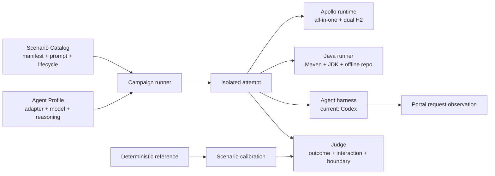

# Apollo Evals

[English](README.md) | **简体中文**

Apollo Evals 旨在构建一套面向 Apollo 实际使用场景的评测框架与任务集，用于衡量不同 agent harness 与模型组合完成 Apollo 真实任务的能力。

## 场景目录

| 产品入口 | 场景 | 确定性结果 |
|---|---|---|
| Apollo CLI | `cli-config-publish` | 类型正确的配置项、生效中的发布、Config Service 返回值、CLI 轨迹、干扰项边界 |
| Apollo CLI | `cli-release-rollback` | 恢复后的发布与配置、已失效的错误发布、列表与回滚轨迹、干扰项边界 |
| Apollo CLI | `cli-namespace-create-publish` | 私有非默认 Namespace、JSON 类型配置项、发布、Config Service 返回值、CLI 轨迹 |
| Apollo CLI | `cli-config-sync-release` | 目标端新增/更新/删除对齐、目标端发布、源端与干扰项不变、diff/apply/delete/release CLI 轨迹 |
| Apollo Java Client | `java-client-typed-read` | 离线编译，以及使用显式 appId/namespace 和默认值完成真实的类型化读取 |
| Apollo Java Client | `java-client-change-listener` | ready 握手、隐藏发布、old/new/changeType 精确回调、在限定时间内正常退出 |

固定版本中的 `apollo config apply` 会新增和更新配置项，但不会删除仅存在于目标端的配置项。因此，sync 场景要求先识别差异，再完成新增/更新、显式删除目标端独有的 key，并创建目标端发布。这是有意设计：评测遵循固定产品版本的真实行为。

## 设计模型

项目将任务、运行配置和判分逻辑拆分为三个领域对象：

- **Scenario Catalog**：`scenarios/<product-track>/<scenario>/` 按 Apollo CLI 与 Java Client 两种产品入口组织场景。每个场景由 `scenario.json`（harness 元数据）、`PROMPT.md`（Agent 可见任务）、`scenario.ts`（`arrange / judge / reference` 生命周期）以及可选 `workspace/` 组成。
- **Agent Profiles**：`agent-profiles/<adapter>/` 描述被比较的 agent harness、模型和 reasoning effort 组合，不包含任务或 runtime 逻辑。
- **Campaign + Calibration**：campaign 选择场景和 profile 产生正式 attempt；calibration 则证明每个场景在初始状态必然失败、确定性 reference 必然通过、无关资源边界保持不变。



Agent prompt 与 harness manifest 在文件层分离；产品入口作为目录层级；场景生命周期、Agent profile、正式 campaign 和场景 calibration 各自拥有独立协议。

## 隔离运行环境

每次 attempt 都会基于锁定镜像创建独立的 Docker network、Apollo 容器和两个名称唯一的内存 H2 数据库。容器内仍使用 8070/8080/8090，宿主机端口由 Docker 动态分配，因此不依赖固定端口或全局串行锁。就绪检查覆盖三个 HTTP 端点、Config/Admin 注册，以及一次真实的 Portal 管理请求。无论成功、失败、超时还是 judge 异常，都会清理本次 attempt 的容器和网络。

Java 场景会额外启动一个独立的 Maven/JDK runner 容器，并通过本次 attempt 的 Docker network 访问 `http://apollo:8080`。准备阶段从 Maven Central 缓存 Apollo Java Client 及构建插件；每次 attempt 把缓存复制到 runner 内部的临时 `/m2`，判分时强制离线执行，既不读取也不污染宿主机的 `~/.m2`。

`arrange` 和 `judge` 通过真实的 Portal 管理接口与 Config Service 请求完成，绝不直接检查 H2。harness 将 Portal 管理员会话保留在内部，并为管理类场景生成一个随机用户 token，其权限只覆盖目标 app 和 `LOCAL` 环境。每次 arrange 还会创建一个名称相似的干扰 app，并要求其状态保持不变。

## 环境要求与产品版本

- Node.js 22+、pnpm、Docker daemon、`curl` 和 `tar`
- 宿主机上已认证、且支持 adapter 所需非交互参数的 Codex CLI（只在执行 campaign/replay 时需要）；不固定 Codex 的精确版本
- 不需要本地 Apollo 源码仓库、JDK、Maven 或 Rust/Cargo

当前默认版本集中配置在 `apollo-evals.config.ts`：Apollo `nobodyiam/apollo-quick-start:3.0.0-SNAPSHOT`、Maven Central 的 Apollo Java Client `2.5.0`，以及 GitHub Release 的 Apollo CLI `0.1.0`。人工配置只维护版本和远程坐标；CLI release asset 的 SHA-256 从 GitHub Release API 自动读取。

`pnpm prepare` 会使用本地已有的 Apollo 镜像（Docker Hub 发布后也可自动 pull），确保 Java runner 镜像可用，下载 CLI release archive，再在 Java runner 镜像内从 Maven Central 预热项目专用的 `.cache/m2`。最终生成的 `versions.lock.json` 记录实际获取的产品版本、远程 URL、SHA-256、镜像 ID/RepoDigest 和平台信息。后续命令会拒绝准备后发生的制品损坏或本地配置漂移。

## 命令

```bash
pnpm install --ignore-scripts
pnpm prepare
pnpm check
pnpm calibrate

# 单场景冒烟
pnpm campaign -- --scenario cli-config-publish \
  --profile codex-gpt-5.6-sol-xhigh --attempts 1

# 六个场景各执行一次
pnpm campaign -- --campaign smoke \
  --profile codex-gpt-5.6-sol-xhigh

# 正式 campaign：六个场景各自独立执行三次
pnpm campaign -- --campaign benchmark \
  --profile codex-gpt-5.6-sol-xhigh

pnpm replay -- --run-id <run-id> --scenario <scenario-id> --attempt <n>
pnpm report -- --run-id <run-id>
```

使用 `--seed <integer>` 可以让每个随机 app、key、value 和 attempt seed 可复现。replay 会读取已记录的 attempt seed，并执行一次新的隔离 attempt。

如需对比 reasoning effort，可将 profile 改为 `codex-gpt-5.6-sol-medium`。默认仍为 `codex-gpt-5.6-sol-xhigh`，两个 profile ID 的结果会分开保存。新增配置时，在 `agent-profiles/<adapter>/` 下增加一个实现 `AgentProfile` 的文件即可。

## 当前 Agent adapter

v0.1 中，Codex adapter 以非交互方式运行，使用 JSONL 和临时会话，忽略用户配置与规则，启用严格配置，不要求工作区是 Git 仓库，并使用允许网络访问的 workspace-write sandbox。每个 Agent 工作区都位于本仓库之外、Docker 可挂载的用户缓存目录中（可通过 `APOLLO_EVALS_WORKSPACE_ROOT` 覆盖），且只包含场景 starter。最终 Java workspace 会复制到 attempt 产物中，随后删除原始工作区。

adapter 有意调用宿主机上的 `codex`，因此本地评测可以直接使用贡献者已有的 ChatGPT coding plan 与认证。campaign 或 replay 启动前，harness 检查 CLI 实际支持的 `codex exec` 能力，而不是精确版本号。

- CLI 场景会在 PATH 中获得固定版本的 `apollo` 二进制文件，以及 `APOLLO_SERVER` 和 `APOLLO_TOKEN`；任务只允许使用对应的 CLI 资源命令。
- Java 场景会获得 starter、指向容器内 Config Service 的 `APOLLO_META`，以及转发到独立 Java runner 的 `mvn`/`java` 命令，但不会获得管理 token。Agent 结束后 runner 会重建，再由隐藏 judge 离线编译和执行。

这个本地开放资料评测允许查阅外部文档。可识别的网页搜索 URL 会作为次要指标记录，但不影响通过/失败判定。

## 判分与结果

只有当所有 `outcome`、`interaction` 和 `boundary` 检查均通过时，本次 attempt 才算通过：

- `outcome`：Apollo 最终状态和客户端可见行为正确；
- `interaction`：确实使用被测的 Apollo 产品入口，而不是旁路；
- `boundary`：基线、干扰应用或其他不在授权范围内的资源没有被改变。

Agent 超时和 adapter 失败属于任务失败。Docker/runtime 启动失败或 judge 崩溃属于 `infra_error`；每次逻辑 attempt 最多可以重试两次基础设施错误。

结果保存在：

```text
results/<run>/<profile>/<scenario>/<attempt>/
  result.json
  provenance.json
  transcript.jsonl
  transcript.normalized.json
  apollo-requests.jsonl
  server.log
  agent.stderr
  prompt.rendered.md
  workspace/
```

run 根目录包含 `summary.json` 和 `summary.md`。每个结果都会记录 Agent CLI 版本输出、adapter、模型标识和 reasoning effort。主要指标是各 profile/scenario 成功率的宏平均值；稳定场景要求全部非基础设施 attempt 都通过。效率中位数只统计通过的 attempt。

Portal 代理只记录时间戳、方法、路径、状态、User-Agent 和认证类型，不记录请求 body 或凭据值。harness 管理的轨迹和日志在落盘前，会对已知 Apollo 凭据、当前 adapter 凭据、Authorization header 和 cookie 脱敏。

## 场景校准

`pnpm calibrate` 会在全新的 Apollo 实例上为每个场景执行三道独立门禁：

1. `arrange` 后立即 `judge`，结果必须失败；
2. 隐藏的确定性 `reference` 执行后，结果必须通过；
3. 所有 `boundary` 检查必须存在且通过。

聚焦开发某个场景时，可使用 `pnpm calibrate -- --scenario <scenario-id>`。calibration 只验证场景与判分器的基本闭环，不代表任何 Agent profile 的能力成绩。

## 设计参考

任务组织和独立验证思路参考了 [Supabase Evals](https://github.com/supabase/evals)。

## v0.1 边界

v0.1 当前提供基于 Docker 的 L1 all-in-one/H2 runtime 和独立 Java runner；尚不包含 MySQL 或多环境 L2 场景、Portal 浏览器场景、Apollo skill 或 skill 消融、更多 Agent adapter、源码修复场景、公开的反作弊保证、Web UI 和排行榜。Codex adapter 本身仍在宿主机的临时工作区运行；计划中的其他 adapter 可以复用同一 Scenario Catalog、判分协议和结果格式。
