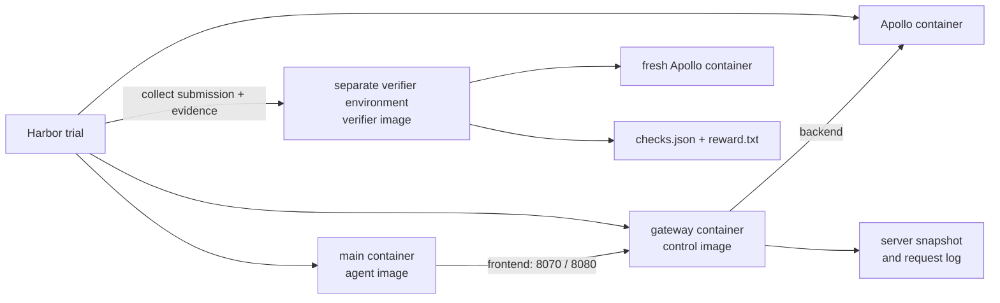

# Architecture

Apollo Evals defines Apollo tasks and their success criteria. Harbor owns job scheduling, agent execution, artifact collection, environment teardown, and verifier execution.

## Runtime topology

Every trial starts an isolated Compose project with a fresh Apollo service and in-memory H2 databases. The agent-facing `main` container is connected only to `frontend`; the Apollo container is connected only to the internal `backend`; `gateway` is the bridge between them.

After agent execution, Harbor asks `gateway` to collect authoritative state, copies the declared artifacts, destroys the execution environment, and starts a separate verifier environment. The verifier cannot reuse agent-created binaries, caches, credentials, or processes.

## Images and containers

An image is a reusable filesystem template. A container is a running instance created from an image. The three local images have different trust roles:

| Image | Used as | Contents and responsibility |
| --- | --- | --- |
| `apollo-evals/agent:0.2.0` | The execution environment's `main` container | Maven/JDK, Python, the pinned Apollo CLI, offline Apollo Java Client dependencies, the Codex executable, `agent-start`, and the CLI trace wrapper. It contains no case definitions or expected answers. Harbor installs/configures the selected agent and runs it as UID 1000. |
| `apollo-evals/control:0.2.0` | The execution environment's `gateway` container | `apollo_testkit` and all task-local `case.py` modules. It initializes the fixture, exposes the restricted agent-facing proxy, records requests, and produces the trusted post-run snapshot. |
| `apollo-evals/verifier:0.2.0` | Base of each task's separate verifier `main` container | Extends the agent image with `apollo_testkit` and all `case.py` modules. This provides the JDK/Maven runtime for clean Java compilation plus the Python grading runtime. Each task's `tests/Dockerfile` adds only its `test.sh` entrypoint. |

The Apollo service itself uses the pinned `nobodyiam/apollo-quick-start` image and is not one of these three project images.

## Gateway bootstrap and proxy surfaces

`images/agent-start.py` runs as the initial process of the execution `main` container. The hostname `gateway` is Docker Compose service discovery for the service named `gateway`, which runs the control image. It is not a process inside the agent container.

Startup proceeds as follows:

1. The control container runs `python -m apollo_testkit.service serve`.
2. `service.py` loads the selected case, creates its deterministic state, initializes Apollo, and starts HTTP servers on ports 8070 and 8080.
3. `agent-start.py` polls `http://gateway:8070/_task`.
4. The `/_task` handler returns only `public_fixture(state)`. Fields listed by a case in `PRIVATE_PUBLIC_FIELDS` are removed; a task token is included only when the case created one.
5. `agent-start.py` writes the response to `/workspace/task.json`, initializes trace files, creates `/tmp/task-ready`, and waits. Harbor's health check then allows the agent to start.

The routes are implemented by the nested `Proxy` handler in `apollo_testkit/service.py`:

| Surface | Allowed routes | Purpose |
| --- | --- | --- |
| `gateway:8070` | `/_task`, `/health`, `/openapi/v1/*` with additional token restrictions | Bootstrap data and restricted Apollo Portal/OpenAPI operations for CLI tasks. |
| `gateway:8080` | `/health`, `/configs/*`, `/configfiles/*`, `/notifications/*`, `/services/config*` | Apollo Config Service access for Java Client tasks. |

Apollo management credentials and Portal login are held only by the control container. Every proxied request is appended to `/var/lib/apollo-evals/requests.jsonl` for later grading evidence.

## Trial lifecycle

1. Harbor builds and starts the task's execution Compose environment.
2. Gateway loads the case and initializes the fixture from `APOLLO_TASK` and `APOLLO_SEED`.
3. `agent-start.py` exposes public task data in the workspace and signals readiness.
4. Harbor runs the selected agent under the task's time and resource limits.
5. Harbor invokes `python -m apollo_testkit.service snapshot` in `gateway` and collects the declared server evidence and submission files.
6. Harbor destroys the execution environment and starts the task's separate verifier environment.
7. The task's `tests/test.sh` calls `python -m apollo_testkit.grade <task-name>`.
8. The grader dispatches to the task-local case and writes `/logs/verifier/checks.json` and `/logs/verifier/reward.txt`.
9. `scripts/report.py` checks job completeness, infrastructure errors, rewards, and named-check contracts.

## Task-local case contract

Every directory under `tasks/` contains one `case.py`. `apollo_testkit.catalog.load_case()` discovers the module and validates its interface before it can initialize or grade a task.

All cases must provide:

| Member | Contract |
| --- | --- |
| `NAME` | Must exactly equal the task directory name. |
| `CATEGORY` | Either `cli` or `java-client`; tests also require it to match `task.toml`. |
| `CHECKS` | Ordered `(name, category)` tuples. Names must be unique, categories must be `outcome`, `interaction`, or `boundary`, and the final entry is the common distractor boundary check. |
| `definition(seed)` | Pure, deterministic construction of private and public task state. It must not call Apollo or read the submission. |
| `initialize(api, state)` | Creates the initial Apollo state and returns the possibly enriched state. Secrets may remain here; only `public_fixture()` is exposed to the agent. |
| `snapshot(api, state)` | Reads authoritative post-agent state used by grading. It must not include the management token. |

CLI cases additionally provide:

| Member | Contract |
| --- | --- |
| `grade(evidence, requests, commands, trajectory)` | Returns one result per entry in `CHECKS`, in the same order. `Checks` supplies the declared names and categories so graders only provide pass/fail logic and optional detail. |

Java Client cases additionally provide:

| Member | Contract |
| --- | --- |
| `JAVA_CLASS` | Submitted class name under the `scenario` package. |
| `VARIANT_CHECKS` | Checks run against both the task seed and a hidden second seed. `CHECKS` must be `VARIANT_CHECKS` followed by the common distractor check. |
| `grade_variant(context)` | Grades one freshly initialized data variant. The shared dispatcher compiles once, runs both variants with isolated caches, and merges each result with logical AND. |

Optional members are:

| Member | Contract |
| --- | --- |
| `PRIVATE_PUBLIC_FIELDS` | Tuple of keys to remove before serving `/_task`. |
| `NEGATIVE_CONTROLS` | Tuple of `(name, mutate_task_directory)` entries. `scripts/negative_controls.py` discovers these without a central task-specific switch. |

`LABEL` and other module constants are local implementation details, not part of the loader contract. Function arity, module fields, check categories, Java-specific fields, and negative-control callability are validated when the case is loaded. The grading entrypoint also rejects results whose names, categories, order, or count differ from `CHECKS`.

## Repository responsibilities

| Path | Responsibility |
| --- | --- |
| `tasks/` | Instructions, budgets, Compose environments, case definitions, reference solutions, and verifier entrypoints. |
| `jobs/` | Oracle, NOP, model smoke, repeated benchmark, and negative-control job configurations. |
| `apollo_testkit/control.py` | Authenticated domain operations against Apollo. |
| `apollo_testkit/service.py` | Fixture initialization, restricted gateway, request evidence, and snapshots. |
| `apollo_testkit/catalog.py` | Case discovery and runtime interface validation. |
| `apollo_testkit/domain.py` | Shared deterministic data and common fixture operations. |
| `apollo_testkit/grading.py` | Shared CLI evidence helpers and isolated Java execution primitives. |
| `apollo_testkit/grade.py` | Thin case dispatcher and Harbor reward-file entrypoint. |
| `images/` | Shared image definitions and agent bootstrap helpers. |
| `scripts/prepare.py` | Download pinned artifacts and build the three project images. |
| `scripts/report.py` | Enforce result completeness and scoring invariants. |

## Trust boundaries

- CLI command traces and agent trajectories are diagnostic agent-side evidence. Server-side request logs and Apollo snapshots independently corroborate normal solutions, but this is not cryptographic attestation against a malicious agent forging its own files.
- Java submissions are restricted to source and a safe POM, compiled offline by the verifier, and executed against two data variants.
- A task receives reward 1 only when every declared outcome, interaction, and boundary check passes. Infrastructure failures cannot produce an accepted result.
