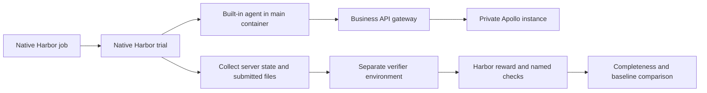

# Harbor-native Apollo Evals

Apollo Evals owns the tasks and the definition of success. Harbor 0.22.0 owns execution.

## Repository responsibilities

| Directory | Responsibility |
| --- | --- |
| `tasks/` | Native task instructions, budgets, Compose environments, reference solutions and verifier entrypoints |
| `jobs/` | Native configurations for oracle, NOP, real-agent smoke, repeated benchmark and negative controls |
| `apollo_testkit/control.py` | Domain operations against actual Apollo services |
| `apollo_testkit/fixtures.py` | Deterministic task data and state snapshots |
| `apollo_testkit/service.py` | Fixture initialization and restricted business API gateway |
| `apollo_testkit/grade.py` | Domain checks and Harbor reward files |
| `images/` | Shared product tools and offline Java dependencies |
| `scripts/prepare.py` | Download pinned tools and build ordinary Docker images |
| `scripts/report.py` | Read Harbor output, enforce acceptance and compare a legacy baseline |

There is no custom Harbor Agent, Environment, Verifier, scheduler or trial runner. New agents use Harbor's built-in adapters and native job configuration. Python testkit modules do not import Harbor.

## Trial lifecycle

1. Harbor builds and starts the task's Compose environment. Every trial owns a new Apollo service and H2 database.
2. The gateway initializes the fixed fixture. `main` receives public inputs and, for CLI tasks, a scoped business token. The health check gates agent startup until initialization completes.
3. Harbor installs or reuses the selected agent, injects runtime authentication, applies the task budget and records its trajectory. The agent runs as UID 1000.
4. Harbor runs the gateway's collection hook and copies declared artifacts. Gateway snapshots and request logs come from a service the agent cannot access as a filesystem.
5. Harbor tears down the execution environment and starts a separate verifier environment. The verifier writes `checks.json` and a binary `reward.txt`.
6. The report command rejects incomplete jobs, exceptions, unexpected rewards and changes to the named check contract. Optional `--baseline` compares task membership, seeds, task status and all check outcomes.

## Task semantics

The six CLI tasks cover configuration publishing, token capability discovery, namespace creation, public namespace consumption, synchronization and rollback. Grading reads actual server state and checks use of resource commands, with independent HTTP request evidence. Unrelated application state remains a boundary check.

The four Java tasks cover typed reads, configuration listeners, cluster precedence and mixed namespace formats. Only source and POM are submitted. A clean verifier compiles offline with the pinned client and runs the submission against two datasets. This catches programs that print known values while retaining superficial API calls. Listener grading publishes a change only after observing the ready event.

The original sixty check names and categories remain stable. All categories gate task success. Agent timeouts and infrastructure errors fail acceptance even if a reward file exists.

## Reproducibility and scope

Task versions, seeds, budgets, product versions and image digests are explicit. `uv.lock` pins Harbor and Python dependencies; `artifacts.lock.json` pins the default Codex platform packages. Shared-image source hashes and resolved image IDs are saved by preparation. Agent credentials and personal network settings stay outside the repository.

The baseline comparison is an outcome comparison. Container execution, Linux CLI artifacts and the added Java dataset mean timing and token usage are not directly interchangeable with the old host-agent implementation.

Independent verification is not a complete adversarial sandbox: Java source checks and agent-side command traces are not cryptographic proof of API use. Domain outcomes are independently tested, and representative wrong solutions are covered by executable negative controls. Cloud Compose support, alternate CPU architectures and the configured Claude Code profile require separate live validation.
